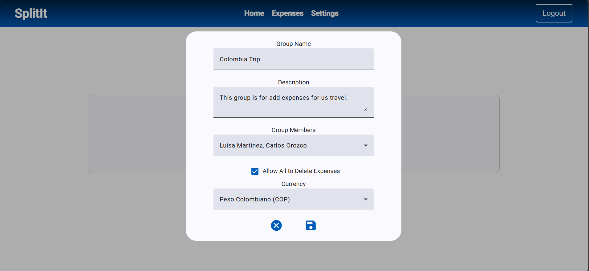
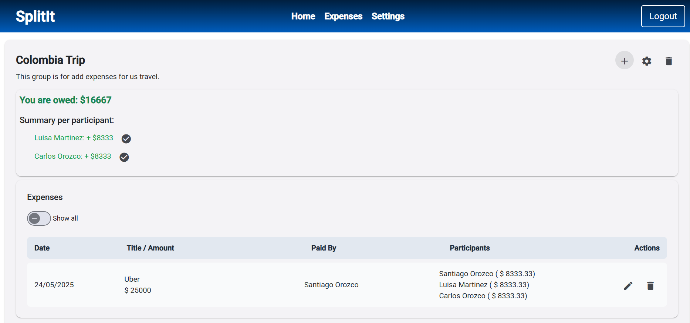
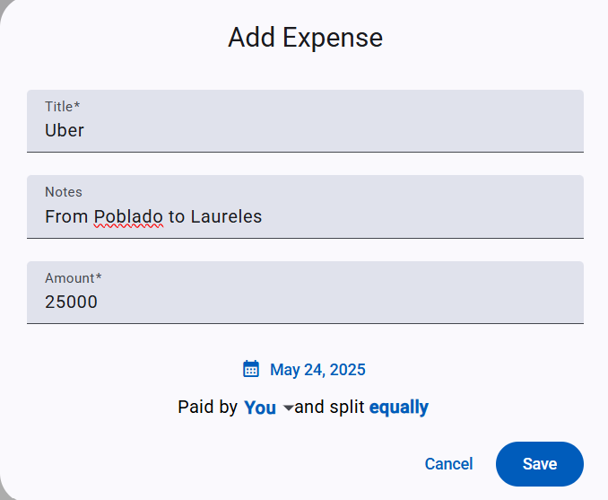

# SplitIt

**SplitIt** is a web application designed to help people manage shared expenses within groups. Whether you're on a trip with friends, splitting rent with roommates, or handling any shared bills, SplitIt simplifies the process of tracking expenses and settling debts fairly.

---

## ✨ Features

- 🧾 Create and manage expense groups
- 👥 Add participants to each group
- 💸 Register shared expenses and specify who paid
- 🔄 Automatically split expenses among members
- 📊 See how much each member owes or is owed
- ✅ Settle individual or total debts
- 🔐 Authentication system with protected routes

---

## 🛠 Tech Stack

- **Frontend**: Angular, Angular Material, SCSS
- **Backend**: .NET 9 Web API (C#)
- **Database**: SQL Server (via Entity Framework Core)
- **Authentication**: JWT (JSON Web Tokens)

---

## 🚀 Getting Started

### Prerequisites

- Node.js and Angular CLI
- .NET 9 SDK
- SQL Server

### Frontend Setup
```bash
cd split-it-ui
npm install
ng serve
```

### Backend Setup
```bash
cd SplitIt.API
dotnet restore
dotnet ef database update
dotnet run
```

## 🖼️ Screenshots
### 🔹 Add group  


### 🔹 Group Overview  


### 🔹 Add Expense Dialog  


## 📌 Future Features
- [ ] Add partial payments functionality  
- [ ] Support alternative split methods (by amount or percentage)  
- [ ] Email validation  
- [ ] Add group admin and application admin roles
