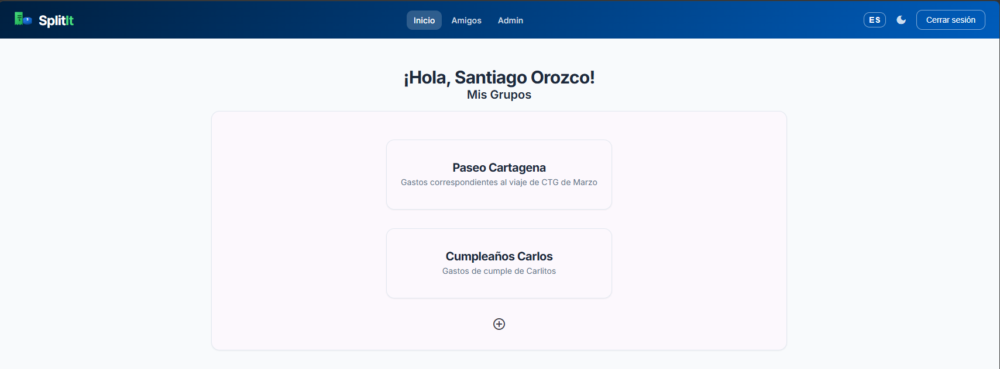
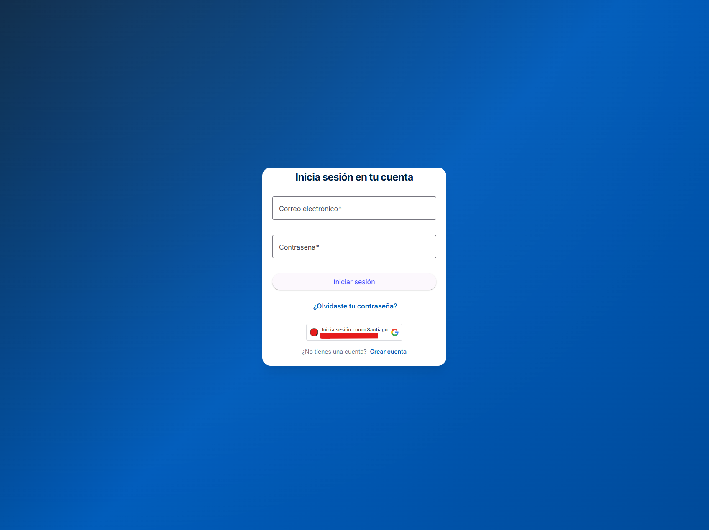
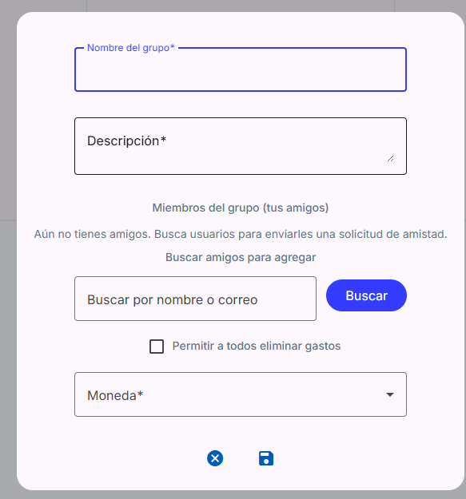

# SplitIt

**SplitIt** is a web application designed to help people manage shared expenses within groups. Whether you're on a trip with friends, splitting rent with roommates, or handling any shared bills, SplitIt simplifies the process of tracking expenses and settling debts fairly.


---

## Features

- Create and manage expense groups
- Add participants to each group
- Register shared expenses and specify who paid
- Automatically split expenses among members (equal, by amount, or by percentage)
- See how much each member owes or is owed
- Settle individual or total debts (including partial payments)
- Friends system: send/accept/reject friend requests, search users
- Admin panel: manage users, roles, settings, currencies
- Group admin: edit group, promote/demote/remove members, invite friends
- Authentication system with protected routes (JWT)
- Real-time notifications for friend requests
- Form validation with inline error messages

---

## Architecture

```
Internet → vps-gateway (:80/:443, private repo)
  └── splitit.santidev21.tech
        ├── /api/*  → splitit-backend (.NET 8)
        ├── /health → splitit-backend (.NET 8)
        └── /*      → splitit-frontend (Angular)
```

**Docker services:**
| Service | Description |
|---|---|
| `splitit-db` | SQL Server 2022 |
| `splitit-db-init` | Creates least-privilege DB users on first run |
| `splitit-migrator` | Runs EF Core migrations then exits |
| `splitit-backend` | .NET 8 API (internal, not exposed publicly) |
| `splitit-frontend` | Angular 19 via nginx (internal, not exposed publicly) |

**Backend Clean Architecture:**
- **`SplitIt.API`** → Controllers, Middleware, Program.cs
- **`SplitIt.Application`** → DTOs, Application Services
- **`SplitIt.Domain`** → Entities, Value Objects, Domain Logic
- **`SplitIt.Infrastructure`** → EF Core, Migrations, External services
- **`SplitIt.Shared`** → Cross-cutting concerns

---

## Tech Stack

| Layer | Technology |
|---|---|
| Frontend | Angular 19, Angular Material, SCSS, Bootstrap |
| Backend | .NET 8 Web API (C#) |
| Database | SQL Server 2022 (EF Core) |
| Auth | JWT (HMAC-SHA256) |
| Gateway | nginx via [vps-gateway](https://github.com/santidev21/vps-gateway) (HTTPS, HSTS, security headers) |
| CI/CD | GitHub Actions (test → build → Trivy scan → deploy) |
| Deploy | Docker Compose on VPS |

---

## Getting Started (Local Development)

### Prerequisites
- Node.js 20+
- .NET 8 SDK
- Docker Desktop (with WSL 2)

### 1. Clone the repo
```bash
git clone https://github.com/santidev21/SplitIt.git
cd SplitIt
```

### 2. Set up environment
```bash
cp .env.example .env
# Edit .env with your local settings
```

### 3. Run with Docker (recommended)
```bash
# Start all services (local bridge networks, debug ports)
docker compose -f docker-compose.yml -f docker-compose.local.yml up --build
```
This starts all 5 services. Backend at `http://localhost:8080`, frontend at `http://localhost:80`.

### 4. Run without Docker (manual)

**Requirements:** SQL Server running locally or via Docker.

```bash
# Option A: Start just SQL Server via Docker
docker run -e "ACCEPT_EULA=Y" -e "SA_PASSWORD=YourStrong!Password123" \
  -p 1433:1433 --name splitit-sql -d mcr.microsoft.com/mssql/server:2022-latest

# Option B: Use your local SQL Server instance
```

**Backend:**
```bash
cd SplitIt.API

# Configure appsettings.Development.json with your connection string:
# "DefaultConnection": "Server=localhost;Database=SplitIt_Dev;Trusted_Connection=True;TrustServerCertificate=True"

dotnet restore
dotnet ef database update --project SplitIt.Infrastructure --startup-project SplitIt.API
dotnet run
```
Backend starts at `http://localhost:5120`. Swagger at `http://localhost:5120/swagger`.

**Frontend:**
```bash
cd split-it-ui
npm install --legacy-peer-deps
npm start
```
Frontend starts at `http://localhost:4200`, auto-proxies API calls to `localhost:5120`.

### 5. Create your first admin user

After registering a user, promote them to SuperAdmin via SQL:
```sql
-- Connect to SplitIt_Dev database
UPDATE Users SET RoleId = 1 WHERE Email = 'your@email.com';
```
Or use the admin panel (requires SuperAdmin role):
```bash
curl -X POST http://localhost:5120/api/admin/promote \
  -H "Authorization: Bearer <superadmin_token>" \
  -H "Content-Type: application/json" \
  -d '{"userId": 2}'
```

---

## Running Tests

```bash
# Backend unit tests
dotnet test SplitIt.API/SplitIt.Back.sln

# Frontend unit tests
npm run test --prefix split-it-ui

# E2E tests (Playwright)
cd split-it-ui
npx playwright install chromium
npx playwright test
```

**Note:** Integration tests (Phase10DatabaseTests, HealthCheckTests, RateLimitingTests) require a running SQL Server instance and are excluded from CI.

---

## CI/CD Pipeline

The GitHub Actions workflow (`.github/workflows/ci.yml`) runs on push to `main`:

| Job | What it does |
|---|---|
| Backend Tests | .NET build + test + coverage |
| Frontend Build & Test | Angular build + unit tests + coverage |
| Playwright E2E | End-to-end browser tests |
| Security Scan | Checks for secrets in code, validates .gitignore/.dockerignore |
| Docker Build & Trivy | Builds images, scans for HIGH/CRITICAL vulnerabilities |
| Docker Compose Validate | Validates compose file syntax |
| Deploy to VPS | SSH into VPS, pulls latest, rebuilds, restarts containers |

**Required GitHub Environment Secrets** (production environment):
| Secret | Description |
|---|---|
| `VPS_SSH_PRIVATE_KEY` | Base64-encoded ED25519 private key for deploy |
| `VPS_HOST` | VPS IP address |
| `VPS_USER` | SSH user |

---

## Production Deployment

### VPS Setup (one-time)
```bash
# Install Docker
curl -fsSL https://get.docker.com | sh
sudo usermod -aG docker $USER

# Clone the repo
sudo mkdir -p /opt/splitit
sudo chown $USER:docker /opt/splitit
git clone https://github.com/santidev21/SplitIt.git /opt/splitit

# Configure environment
cd /opt/splitit
cp .env.example .env
# Edit .env with production secrets

# Create Docker network
docker network create splitit-net

# Start services
docker compose up -d
```

### Deploy Updates
Deploys happen automatically on push to `main` via GitHub Actions. Manual deploy:
```bash
cd /opt/splitit
./scripts/deploy.sh deploy
```

### Other Deploy Commands
```bash
./scripts/deploy.sh status    # Show container status
./scripts/deploy.sh logs      # Show recent logs
./scripts/deploy.sh rollback  # Rollback to last backup
./scripts/deploy.sh verify    # Verify all services healthy
```

---

## Security

- JWT tokens signed with HMAC-SHA256 (64+ char secret required in production)
- BCrypt password hashing (with automatic rehash on login)
- Rate limiting at gateway: 30r/m auth, 100r/m API, 200r/m general (in [vps-gateway](https://github.com/santidev21/vps-gateway))
- CORS restricted to configured origins only
- Docker containers run as non-root (except SQL Server on Docker Desktop Windows)
- Internal Docker network isolates database from external access
- No database ports exposed to host
- Trivy vulnerability scanning in CI
- Security headers applied by gateway: HSTS, CSP, X-Frame-Options, etc.

---

## Screenshots

### Login view


### Add Group


### Group Overview


### Add Expense Dialog


---

## Future Features
- [x] Partial payments functionality
- [x] Support alternative split methods (by amount or percentage)
- [x] Email validation
- [x] Group admin and application admin roles
- [x] Friends system with requests
- [x] Admin panel with settings
- [x] Form validation and error feedback
